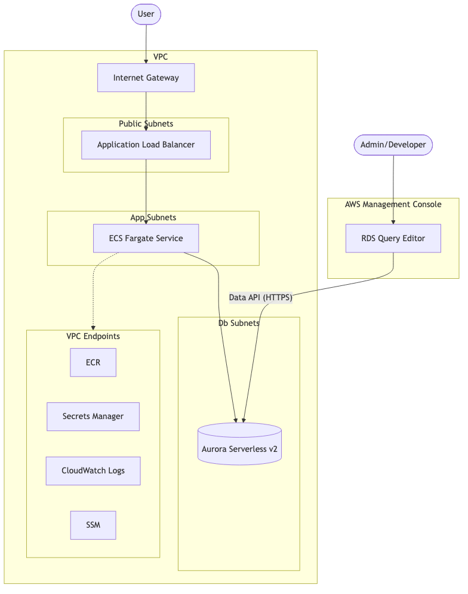

# AWS CDK Serverless WebAPI サンプルコード

AWS CDK v2を用いた、サーバーレスWeb APIインフラのIaC（Infrastructure as Code）サンプルプロジェクトです。

## はじめに

このプロジェクトは、AWS上にスケーラブルでセキュアなサーバーレスWeb API環境を構築するためのテンプレートです。VPC、ECS Fargate、Aurora Serverless v2を組み合わせた、モダンなサーバーレスアーキテクチャを採用しています。

## 構成

このインフラ構成は、マルチAZ冗長化とサブネットによる階層的なセキュリティ管理を行っています。



### 主な特徴

- **ネットワーク**: 2つのAZを利用した高可用性構成。
- **セキュリティ**: セキュリティグループによる最小権限の通信制御。
- **データベース**: **Aurora Serverless v2** (PostgreSQL 17.7) を採用し、負荷に応じた自動スケーリングを実現。
- **Data API**: **RDS Data API** を有効化しており、マネジメントコンソールの「クエリエディター」から安全にSQLを実行可能。
- **コンテナー**: ECS Fargateを使用した完全サーバーレスな実行環境。

## 実行方法

### 準備

- Node.jsおよびpnpmのインストール
- AWS CLIのセットアップと認証（`aws login` 等）
- Docker Desktopの起動（コンテナイメージのビルドに使用）

### 手順

コマンドはすべて `src/` ディレクトリ内で実行してください。

1. **依存パッケージのインストール**

   ```bash
   cd src
   pnpm install
   ```

2. **TypeScript のビルドとテスト**

   ```bash
   pnpm build
   pnpm test
   ```

3. **デプロイ**

   ```bash
   pnpm exec cdk deploy
   ```

## データベースの初期化

デプロイ完了後、AWSマネジメントコンソールの **RDS > クエリエディター** を使用してテーブル作成やデータ投入を行えます。

1. クエリエディターで対象のクラスターを選択。
2. 認証にはSecrets Managerのシークレットを指定。
3. 必要なDDL（テーブル作成用SQL等）を手動で実行。

## 削除方法

課金を防ぐため、不要になったリソースは以下のコマンドで削除してください。

```bash
cd src
pnpm exec cdk destroy
```

---

_参考文献_: [本番で使えるFargate環境構築をCDKでやってみる - 虎の穴ラボ技術ブログ](https://toranoana-lab.hatenablog.com/entry/2024/08/15/130000)
