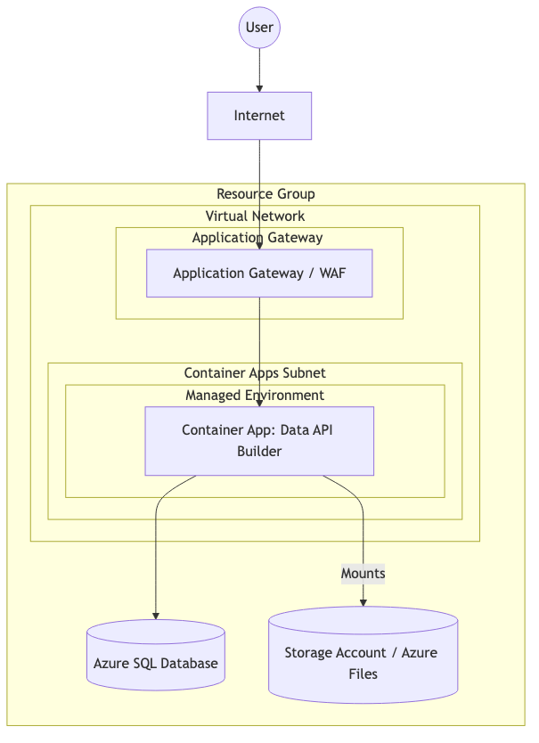

# Azure Data API Builder IaC

## はじめに

このリポジトリは、Azure Data API Builder (DAB) をAzure Container Apps (ACA) 上に構築し、Application Gatewayを介してセキュアに公開するためのaC (Infrastructure as Code) プロジェクトです。
バックエンドのデータベースとしてzure SQL Database使用し、一連の構築フローを自動化しています。

## 実行方法

以下のスクリプトを実行することで、リソースグループの作成から各リソースのデプロイ、データベースの初期化までを自動で行います。

```powershell
./Deploy.ps1
```

※事前にAzure CLIでログイン (`az login`) している必要があります。
※スクリプト内の設定値（リソース名やログイン情報など）は必要に応じて書き換えてください。

## 実装の内容

本プロジェクトでは以下のリソースをBicepで定義し、PowerShellスクリプトで連携させています。

1. **データベースの構築**: `Database.bicep` を使用してAzure SQL Database作成します。
2. **テーブルの初期化**: `CreateTable.sql` を実行し、DABで公開するためのサンプルテーブルを作成します。
3. **ストレージの準備**: `Storage.bicep` を使用してAzure Files (Storage Account) を作成します。
4. **設定の反映**: `dab-config.json` を Azure Filesへアップロードします。
5. **コンテナアプリのデプロイ**: `Application.bicep` を使用して、VNet統合されたManaged Environment、DABコンテナー、およびApplication Gatewayを構築します。

## 構成図



## 参考文献

本実装は、以下の公式サンプルコードをベースに、VNet統合やデプロイフローの最適化を行ったものです。

- [Azure Data API Builder Samples (Azure)](https://github.com/Azure/data-api-builder/tree/main/samples/azure)
